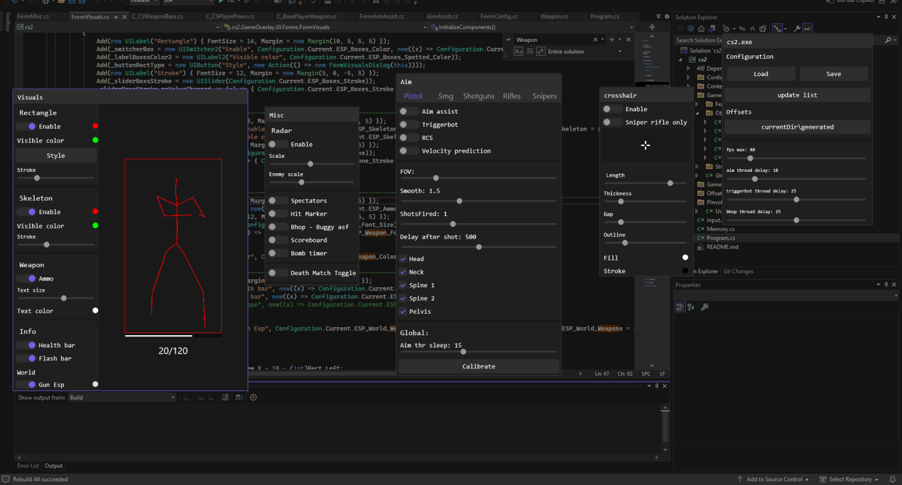

# 1.0.0.2
+ Main
+ Added a setting to select a separate color for a visible enemy
+ You can now choose the display type of the player rectangle
+ Moving some UI elements to their rightful place
+ Other
+ Added UI element RadioButton
+ Added a player visibility property
+ Fixes
+ Fixed aiming

# V1 .0.0.0
+ Main
+ Added a delay setting after firing
+ Now the aiming calibration remembers the value in the file
+ Changed the visual part of the hit indicator
+ Now you can choose which bones will be aimed at
+ Other
+ Added UI element Checkbox
+ Slightly improved aiming
+ aim update
+ Slightly improved Ui
  

